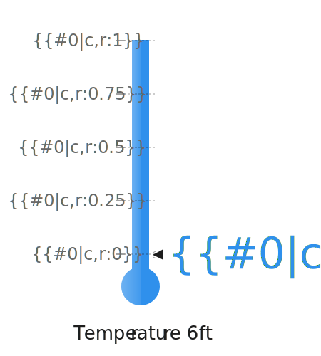

<!--  -->

The project holds a gallery that organizes svg files annotated for the [Dynamic Vector Graphics](https://jrbenson.github.io/dynamic-vector-graphics) library.

## Usage

For production use the annotated svg files and the Dynamic Vector Graphics library files should be hosted on a production server. The URLs provided here are for quick testing using Unpkg and GitHub hosting. Additionally the gallery struture may change and break links.

## Collections

### Domains

This collection holds domain-specific illustrations for industries like healthcare or banking.

#### Vaccination

Illustrations related to vaccination and disease prevention.

#### Automotive

Illustrations related to automotive concepts.

### General

This collection holds illustratations that are not domain specific and instead are focused on a particular visual look or theme.

### Test

This collection is a holding ground before svgs are formally sorted into a permanent collection and a place for svgs used to test the system. As such links to them are particularly likely to be broken in the future.

**Airplane Top**


```url
https://jrbenson.github.io/sas-visualanalytics-dvg/?svg=https://jrbenson.github.io/dvg-gallery/svg/test/airplane-top.svg
```

**Airplane Profile**


```url
https://jrbenson.github.io/sas-visualanalytics-dvg/?svg=https://jrbenson.github.io/dvg-gallery/svg/test/airplane-profile.svg
```

**Temperature Gauge**


```url
https://jrbenson.github.io/sas-visualanalytics-dvg/?svg=https://jrbenson.github.io/dvg-gallery/svg/test/gauge-temperature.svg
```

## JSON Format

To facilitate searching or use in other tools the gallery information is stored within a structured JSON file.

[gallery.json](./gallery.json)

<!--  -->
